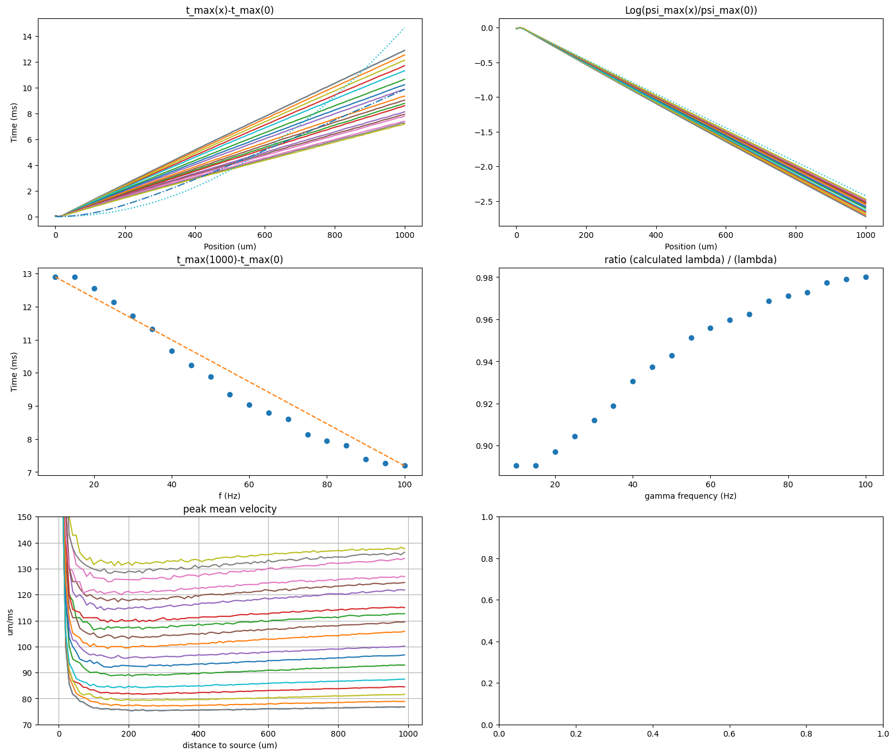

# dendritic-segment-model

A Python package to simulate dendritic segments with synaptic inputs.

## Summary

`dendritic-segment-model` is a lightweight Python package designed to simulate passive dendritic segments with synaptic inputs.  
It provides a transparent framework to explore fundamental phenomena in computational neuroscience, including:

- Sublinear synaptic integration (joint responses smaller than the sum of individual inputs).  
- Frequency-dependent propagation (theta–gamma coupling, faster transmission at higher gamma frequencies).  
- Modulation of propagation dynamics by synaptic weight (trade-off between speed and attenuation).  
- Deviations from Rall’s classical cable law, with effective length constants ~10% lower due to localized synaptic currents.  
- Realistic propagation velocities (≈ 0.075–0.13 m/s), consistent with experimental reports in hippocampal and neocortical neurons.

This package acts as a bridge between theoretical models and full-featured simulators (NEURON, Brian2), making dendritic dynamics easier to understand, teach, and experiment with.

## Table of Contents
- [Installation](#installation)
- [Quick Start](#quick-start)
- [Dependencies](#dependencies)
- [Examples](#examples)
- [Motivation / Interest](#motivation--interest)
- [License](#license)
- [Contributing](#contributing)
- [Methodology](#methodology)
- [Results](#results)
- [Discussion](#discussion)
- [Conclusion](#conclusion)

## Installation

Clone the repository and install locally:

```bash
git clone https://github.com/jietra/dendritic_segment_model
cd dendritic_segment_model
pip install .
```
## Quick Start

```python
from dendrite import Parameters, Synapse, DendriticSegment

# Define parameters
params = Parameters(T=50.0, dt=0.1, dx=0.01, L=1e-3)

# Create one excitatory synapse at the center
syn = Synapse(syn_type=1, position=0.5, weight=1.0, spike_times=[10.0])

# Initialize and run simulation
segment = DendriticSegment.from_params(params, [syn])
segment.simulate()

# Print description
print(segment.describe())
```
## Dependencies

- Python >= 3.9
- numpy
- matplotlib (for visual outputs)
- numba (optional, for faster simulations)

## Examples

See the `examples/` folder for usage demonstrations:
- `run_simulation.py`: minimal simulation with one synapse
- multi-synapse simulation with excitatory + inhibitory inputs

## Motivation / Interest

The goal of this project is to provide a lightweight and transparent framework to explore dendritic integration phenomena.  

- **Scientific motivation**  
  Dendrites are more than just passive cables: they filter, integrate, and transform synaptic inputs in complex ways.  
  This package highlights key phenomena such as sublinear synaptic integration and frequency-dependent propagation (e.g., theta–gamma coupling).  

- **Pedagogical interest**  
  Unlike heavy simulators (NEURON, Brian2), this model focuses on clarity and accessibility.  
  It is designed to illustrate fundamental concepts in computational neuroscience without requiring advanced biophysical details.  

- **Practical interest**  
  The modular design (`Parameters`, `Synapse`, `DendriticSegment`) makes it easy to extend and adapt.  
  It is well suited for quick prototyping, demonstrations, and exploratory simulations.  

### Comparison with existing tools

| Tool      | Focus                          | Strengths                          | Limitations                                |
|-----------|--------------------------------|------------------------------------|--------------------------------------------|
| NEURON    | Biophysical realism            | Multi-compartment, ion channels, realistic morphologies | Steeper learning curve, heavier setup      |
| Brian2    | Flexible spiking networks      | Easy prototyping, fast, customizable equations | Dendritic modeling possible but requires manual setup; no native morphology support |
| This pkg  | Passive dendritic segments     | Lightweight, transparent, didactic | Simplified, currently limited to passive dynamics (no active ion channels) |

This project therefore acts as a bridge between theoretical models and full-featured simulators, making dendritic dynamics easier to understand and experiment with.

## License

This project is licensed under the MIT License – see the [LICENSE](LICENSE) file for details.

## Contributing

Contributions are welcome! Please open an issue or submit a pull request.


# Methodology

We consider a dendritic segment of length $L$, characterized by a membrane capacitance $C_m$ (expressed in ms·S/m²). We take the millisecond as the unit of time. Along this dendritic segment, we use a normalized coordinate system, where the position is given by $x \in [0,1]$. The distance between position $x$ and the origin (which may correspond to the soma or another dendritic segment) is $x \cdot L$.

## General Diffusion Model

We consider the following general equation for the membrane potential $V_m(x,t)$ at time $t$:

$$C_m \cdot \frac{\partial V_m}{\partial t}(x,t) =C_m \cdot D_L \cdot \frac{\partial^2 V_m}{\partial x^2}(x,t)- I_{leak}(V_m(x,t))- I_{syn}(V_m(x,t), x, t)- I_{ions}(V_m(x,t), t)$$

Where:

- **Diffusion coefficient**:  
  $D_L = D/L^2$ is the normalized diffusion coefficient (in ms⁻¹), with $D$ the diffusion coefficient (in m²/ms).

- **Leak current**:  
  $I_{leak}(V) = g_{leak} \cdot (V - E_{leak}) = \frac{C_m}{\tau} \cdot (V - E_{leak})$    
  $E_{leak}$ is the leak reversal potential (corresponding to the resting potential, typically $-65$ mV), and $\tau$ the membrane time constant.  
  *Note: the leak conductance* $g_{leak}(x,t)$ *could be defined spatially, but we assume it remains locally stable.*

- **Synaptic current**:  
  $I_{syn}(V, x, t) = \sum_i I_{syn,i}(V, x, t)$  
  For a synapse $i$ located at $x_i$:  
  $I_{syn,i}(V, x, t) = g_{syn,i}(t) \cdot (V - E_{rev,i}) \cdot \delta(x-x_i)$  
  Where:
  - $E_{rev,i} = E_{\text{rev}}^{(E)}$ for excitatory synapses (typically $E_{\text{rev}}^{(E)}=0$ mV).  
    *Excitatory synapses typically use glutamate (AMPA/NMDA receptors).*  
  - $E_{rev,i} = E_{\text{rev}}^{(I)}$ for inhibitory synapses (typically $E_{\text{rev}}^{(I)}=-70$ mV).  
    *Inhibitory synapses typically use GABA (GABA A/B receptors).*

  - $g_{syn,i}(t) = w_i(t) \cdot \overline{g}_i \cdot s_i(t)$, with:
    - $w_i(t)$: synaptic weight (subject to plasticity).  
    - $\overline{g}_i$: maximal conductance.  
      *Long-term plasticity (LTP/LTD) can be modeled by changes in* $w_i$ *or by updating* $\overline{g}_i$.  
    - $s_i(t)$: normalized synaptic activation trace:
      $$s_i(t) = S \cdot \sum_f \left( e^{-(t-t_i^{(f)})/\tau_d} - e^{-(t-t_i^{(f)})/\tau_r} \right) H(t-t_i^{(f)})$$
      $H$ is the Heaviside function (*we take* $H(0)=1$), $S$ is the normalization factor (such as a unitary spike is normalized to $1$), $\tau_r$ (resp. $\tau_d$) stand for the rise (resp. decay) time constant of a unitary spike, $t_i^{(f)}$ is the time of an incoming spike (indexed by $f$). In simulations, we typically use $\tau_r=2$ ms and $\tau_d=10$ ms, giving $S \approx 1.869$.

  - $\delta(x-x_i)$ is the Dirac distribution, concentrating the synaptic interaction at $x_i$.  
    *A more realistic model could use a compact neighborhood distribution (Gaussian, cosine, etc.).*

- **Active ionic currents**:  
  $I_{ions}(V,t)$ represent currents from active ion channels (Na⁺, K⁺, Ca²⁺, HCN). In this article, we focus on passive dendritic properties and assume subthreshold conditions, so these currents are neglected.

## Reduced Membrane Potential

We define the reduced potential:

$$\psi(x,t) = -\frac{V_m(x,t)-E_{leak}}{E_{leak}}$$

Thus, $\psi > 0$ indicates depolarization, and $\psi < 0$ hyperpolarization.

Under these conditions, we rewrite the general equation in its passive form:

$$\frac{\partial \psi}{\partial t}(x,t) =D_L \frac{\partial^2 \psi}{\partial x^2}(x,t)- \frac{\psi(x,t)}{\tau}+ \sum_i \frac{w_i s_i(t)}{\overline{\tau}_i} \cdot (e_i - \psi(x,t)) \cdot \delta(x-x_i)$$

Where:

- $\overline{\tau}_i = C_m / \overline{g}_i$
- $e_i = (E_{leak} - E_{rev,i}) / E_{leak}$

Numerically:
- $e_i \approx 1$ for excitatory synapses  
- $e_i \approx 0$ for inhibitory synapses  

*Interpretation: An excitatory synapse introduces a positive term in the equation, driving the growth of the normalized potential, while an inhibitory synapse contributes only to the leak term (in* $-\psi$*).*

## Spectral Projection Solution

We recall here the resolution of equation (see passive form above) using Fourier transform and the one-dimensional Green’s function, which forms the basis of our numerical simulations.

We extend $\psi$ to $\mathbb{R}^2$, taking value $0$ outside $[0,1] \times \mathbb{R}$.  
We consider the inner product on spatial coordinates defined by:

$$\forall f,g \in L^2(\mathbb{R}), \quad \langle f,g \rangle = \int \overline{f} g$$

To solve the equation, we project onto the space generated by $\{\phi_k: x \mapsto e^{jkx}\}_{k \in \mathbb{R}}$.  
For any function $f:(x,t)\mapsto f(x,t)$, we denote:

$$\hat{f}_k(t) = \langle \phi_k, f(\cdot,t) \rangle = \int e^{-jkx} f(x,t) dx$$

From the passive equation:

$$\langle \phi_k, \frac{\partial \psi}{\partial t}(\cdot,t) \rangle =D_L \langle \phi_k, \frac{\partial^2 \psi}{\partial x^2}(\cdot,t) \rangle- \frac{\hat{\psi}_k(t)}{\tau}+ \sum_i \frac{w_i s_i(t)}{\overline{\tau}_i} e^{-jkx_i} \left(e_i - \psi(x_i,t)\right)$$

After integration by parts and simplification, we obtain:

$$\frac{d \hat{\psi}_k}{dt}(t) = -\mu_k \hat{\psi}_k(t)+ \sum_i \frac{w_i s_i(t)}{\overline{\tau}_i} e^{-jkx_i} \left(e_i - \psi(x_i,t)\right)+ D_L \left[d_{k,t}(x)\right]_{0}^{1}$$

where $\mu_k = D_L k^2 + 1/\tau$ and $d_{k,t}(x) = (\partial_x \psi(x,t) + jk \psi(x,t)) e^{-jkx}$.

Defining $a_k(t) = \hat{\psi}_k(t) e^{\mu_k t}$, we get:

$$\frac{d a_k}{dt}(t) =\sum_i \frac{w_i s_i(t)}{\overline{\tau}_i} e^{-jkx_i} e^{\mu_k t} \left(e_i - \psi(x_i,t)\right)+ D_L \left[d_{k,t}(x)\right]_{0}^{1} e^{\mu_k t}$$

Thus:

$$a_k(t) = a_k(0) + \sum_i \frac{e^{-jkx_i}}{\overline{\tau}_i}\int_0^t w_i s_i(u) \left(e_i - \psi(x_i,u)\right) e^{\mu_k u} du+ D_L \int_0^t \left[d_{k,u}(x)\right]_{0}^{1} e^{\mu_k u} du$$

And therefore:

$$\hat{\psi}_k(t) = a_k(0) e^{-\mu_k t}+ \sum_i \frac{e^{-jkx_i}}{\overline{\tau}_i} \int_0^t w_i s_i(u) \left(e_i - \psi(x_i,u)\right) e^{-\mu_k(t-u)} du+ D_L \int_0^t \left[d_{k,u}(x)\right]_{0}^{1} e^{-\mu_k(t-u)} du$$

By inverse Fourier transform:

$$\psi(x,t) = \frac{1}{2\pi} \int_{-\infty}^{+\infty} \hat{\psi}_k(t) e^{jkx} dk$$

which decomposes into:

$$\psi(x,t) = A_0(x,t) + \Psi(x,t) + \Phi(\psi)(x,t)$$

---

### Interpretation of the terms

- **Transient term**
  
  $$A_0(x,t) = \frac{e^{-t/\tau}}{2\pi} \int_{-\infty}^{+\infty} a(k) e^{-D_L k^2 t} e^{jkx} dk$$  

  *This corresponds to a transient regime, damped with characteristic time* $\tau$ *. The function* $a(k)$ *represents the initial condition at* $t=0$*.*

- **Synaptic term**  

  $$\Psi(x,t) = \sum_i \frac{1}{\overline{\tau}_i} \int_0^t w_i s_i(u) \left(e_i - \psi(x_i,u)\right) G(x-x_i,t-u) du$$  

  with the Green’s function:  

  $$G(x-x_i,t-u) = \frac{H(t-u) e^{-(t-u)/\tau}}{\sqrt{4\pi D_L (t-u)}} \exp\left(-\frac{(x-x_i)^2}{4D_L(t-u)}\right)$$  

  *Here* $H$ *is the Heaviside function, with* $H(0)=1$*.*

- **Boundary term**  

  $$\Phi(\psi)(x,t) = D_L \int_0^t \left[ G(x-x',t-u) \frac{\partial \psi(x',u)}{\partial x'} - \psi(x',u) \frac{\partial G(x-x',t-u)}{\partial x'} \right]_{x'=0}^{x'=1} du$$  

  *This represents a temporal memory of current flux at the segment boundaries, useful in multi-compartment models.*

---

### Notes

- $A_0$ depends only on diffusion parameters $D_L$ and $\tau$ (and initial condition $a$).  
- $\Psi$ depends on synaptic parameters $\{w_i, s_i, \tau_i, \psi_i\}$.  
- $\Phi$ depends on diffusion parameters and boundary conditions at $x=0$ and $x=1$.

For sufficiently large $t$, the transient term $A_0$ is damped and can be neglected. We then focus on $\Psi$, the synaptic contribution. We easily verify that $\Psi$ is a solution of our equation, and $\Phi(\Psi)\equiv 0$.

## Numerical Simulations  

The code computes recursively a sequence of functions $\Psi_n:[0,1] \to \mathbb{R}$ such that $\Psi_0 \equiv 0$ and:

$$\Psi_{n+1}(x) = \sum_i \frac{\delta t}{\overline{\tau}_i} \sum_{p=0}^{n} w_i s_i \left( p \delta t\right) \cdot \left(e_i - \Psi_p(x_i)\right) G \left(x-x_i, \delta t \cdot (n+1-p)\right)$$

Thus:

$$\Psi(x,t) \sim \Psi_{\lfloor t/\delta t \rfloor}(x)$$

as $\delta t \to 0$, given the regularity of the functions involved. For numerical simulations, we typically use a discrete time step $\delta t = 0.01$ ms.

## Results

This section summarizes some preliminary scientific findings obtained with the dendritic segment model.  
🚧 Work in progress: more detailed figures and quantitative analyses will be added soon.

- **Sublinear synaptic integration**  
  Simulations with two excitatory synapses show that the combined response is not simply additive.  
  Instead, the dendrite exhibits *sublinear integration*, meaning that the joint potential is smaller than the sum of individual contributions.  
  This highlights the non-trivial role of dendritic geometry and passive properties in shaping synaptic input.
  - **Sublinear integration (proof sketch)**  
  Let $\Psi^A$ and $\Psi^B$ be the responses to single synapses $A$ and $B$, and $\Psi^{AB}$ the joint response.  We compute:
  $$\Delta(x,t) = \Psi^A(x,t) + \Psi^B(x,t) − \Psi^{AB}(x,t) = \int_0^t (w_A s_A(u) / \bar{\tau}_A) \cdot (\Psi^{AB}(x_A,u)-\Psi^A(x_A,u)) \cdot G(x-x_A, t-u) du + \int_0^t (w_B s_B(u) / \bar{\tau}_B) \cdot (\Psi^{AB}(x_B,u)-\Psi^B(x_B,u) \cdot G(x-x_B, t-u) du \geq 0$$
  Hence $\Psi^{AB}(x,t) \leq \Psi^A(x,t) + \Psi^B(x,t)$.  
  Intuitively, the membrane potential already present at the input site reduces the effective synaptic drive $(e_i − \Psi)$, producing sublinear summation.

- **Synaptic weight modulates propagation dynamics**  
  In simulations with a single synaptic input (no oscillation), increasing the synaptic weight leads to slower peak propagation but reduced attenuation.  
  This reflects a trade-off between signal intensity and diffusion speed: stronger inputs generate broader peaks that diffuse more slowly, yet maintain amplitude over longer distances.

- **Influence of signal frequencies**  
  We tested inputs combining two oscillatory components:  
  - A slow *theta* frequency (transport signal).  
  - A faster *gamma* frequency (embedded signal).  
  
  Results show that the propagation speed of the potential peak along the dendrite depends on this frequency coupling.  
  In particular, the theta rhythm modulates how gamma bursts travel, leading to different propagation velocities compared to single-frequency inputs.

- **Frequency-dependent propagation vs Rall’s law**  
  Increasing the gamma frequency leads to faster propagation of the potential peak and reduced attenuation along the dendrite.  
  Interestingly, compared to Rall’s classical passive cable law, the effective length constant (λ) is about 10% lower in our simulations. This difference arises because synaptic currents act as localized sources, which profiles alter the spatial attenuation predicted by a purely passive cable without inputs.

- **Propagation velocity and frequency dependence**  
  We find that the peak propagation velocity depends on the distance from the synaptic source and stabilizes around 75–130 µm/ms (~0.075–0.13 m/s) at ~100 µm from the source.  
  This effect is observed for gamma frequencies ranging from 10 to 100 Hz, coupled with a theta rhythm at 9 Hz.  
  These values are consistent with reported dendritic propagation speeds in hippocampal and neocortical neurons, and confirm that dendrites act as frequency-dependent filters.

These findings illustrate how dendritic segments can act as complex filters, shaping synaptic integration and frequency-dependent signal propagation.




**Figure X. Frequency-dependent propagation and attenuation in a passive dendritic segment model.**  
Top-left: Time delay of peak potential (`t_max(x) - t_max(0)`) as a function of distance from the synaptic source.  
Solid lines: simulated delays for different gamma frequencies.  
Dotted line (`:`): theoretical delay from free diffusion (`∝ x²`).  
Dash-dot line (`-·-`): delay predicted by the Green’s function for a point-source diffusion.  
→ The simulated propagation shows an almost linear dynamic, with velocity growing with gamma frequency. It is slower than free diffusion up to ~0.5–0.9 mm (depending on frequency) but faster at longer ranges, aligning more closely with the Green’s function prediction. The convolution of the bi-exponential synaptic current with the Green’s function produces a flatter dynamic.  

Top-right: Logarithmic decay of peak amplitude (`log(ψ_max(x)/ψ_max(0)`) with distance.  
Solid lines: simulated attenuation for different gamma frequencies.  
Dotted line (`:`): theoretical attenuation from Rall’s passive cable law (`∝ exp(-x/λ)`).  
→ The simulated decay is steeper than Rall’s prediction, showing an effective λ ~10% lower. This difference arises because we compute the decay of the peak, whereas Rall’s λ characterizes global diffusion. Higher gamma frequencies extend the influence over longer distances, reducing the gap with Rall’s λ.   

Middle-left: Propagation delay between 0 and 1000 µm as a function of gamma frequency.  
→ Higher frequencies lead to faster transmission, confirming frequency-dependent propagation.  

Middle-right: Ratio of calculated λ (for peak propagation) to theoretical λ (from Rall’s law) as a function of gamma frequency.  
→ The effective λ increases with frequency, but remains below the theoretical value, indicating localized synaptic effects.  

Bottom-left: Peak mean velocity as a function of distance to source.  
→ Velocity stabilizes around 75–130 µm/ms (~0.075–0.13 m/s) at ~100 µm, consistent with known dendritic propagation speeds.  

Bottom-right: Placeholder for future results or control condition.

Overall, these results illustrate how dendritic segments act as frequency-dependent filters: 
propagation dynamics deviate from both free diffusion and Rall’s law due to the convolution 
of localized synaptic currents with the passive Green’s function.

## Discussion

Our results reveal a clear distinction between the effects of synaptic weight and input frequency on dendritic integration. While increasing synaptic weight primarily enhances local amplitude, its influence on propagation velocity and effective length constant (λ) remains modest. In contrast, increasing input frequency produces a stronger modulation of propagation dynamics: higher frequencies accelerate transmission, extend the effective λ, and broaden the spatial reach of synaptic signals. This suggests that temporal activity patterns exert a more pronounced control over dendritic filtering than static weight changes.

From the perspective of synaptic plasticity, these findings highlight complementary roles for weight and frequency. Weight potentiation corresponds to the classical view of Hebbian learning, where local synapses become stronger and encode stable memory traces. Frequency modulation, however, acts more dynamically: repeated activation patterns not only increase amplitude through temporal summation but also reshape the propagation regime, allowing synapses to influence more distant dendritic regions. This duality resonates with established models such as STDP and TagTriC, which emphasize both local strengthening and activity-dependent tagging, while pointing to less explored aspects of how dendritic integration itself may contribute to continuous learning.

Interestingly, although classical cable theory predicts a monotonic decrease of λ with frequency under oscillatory stimulation (Ilmoniemi et al., 2016), our passive model shows the opposite trend: λ increases with input frequency. This discrepancy likely reflects methodological differences: we measure λ on transient synaptic trains rather than continuous sinusoids. In this regime, temporal summation locally enhances amplitude and propagation, producing a window of frequency-dependent facilitation. This observation is reminiscent of the increase in vector strength reported by Eyal et al. (2014) below ~100 Hz, suggesting that dendritic integration under realistic synaptic dynamics may exhibit facilitation at low frequencies before classical filtering dominates. *Note: In the context of oscillatory brain rhythms, 100 Hz belongs to the high-gamma band. However, in cable theory studies exploring frequencies up to several kilohertz, 100 Hz is still considered low frequency. Our results therefore highlight a facilitation regime at 'low' frequencies in the cable-theory sense, which overlaps with the high-gamma range in EEG terminology.*

In summary, plasticity can be interpreted as a two-dimensional process: changes in synaptic weight stabilize local memory, whereas changes in input frequency modulate distributed influence across the dendritic tree. This distinction underscores the importance of considering dendritic integration in models of memory persistence and adaptive learning, bridging classical cable theory with functional implications for artificial and biological intelligence.

## Conclusion

This work illustrates how dendritic integration highlights complementary roles of synaptic weight and input frequency.  
- **Weight changes** directly strengthen local synapses, encoding stable memory traces in line with classical Hebbian plasticity.  
- **Frequency changes** primarily modulate propagation and effective reach, producing transient memory effects through activity-dependent dynamics. Only repeated frequency patterns can consolidate into lasting plasticity.  

Together, these results suggest that memory emerges not only from stronger synapses but also from faster rhythms. Dendritic segments act as filters where local stability and temporal dynamics interact, providing a substrate for both persistent and distributed forms of memory.
